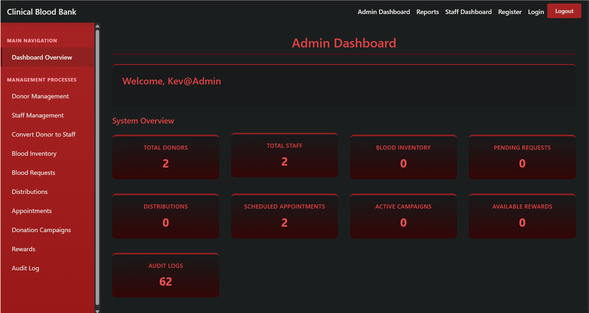
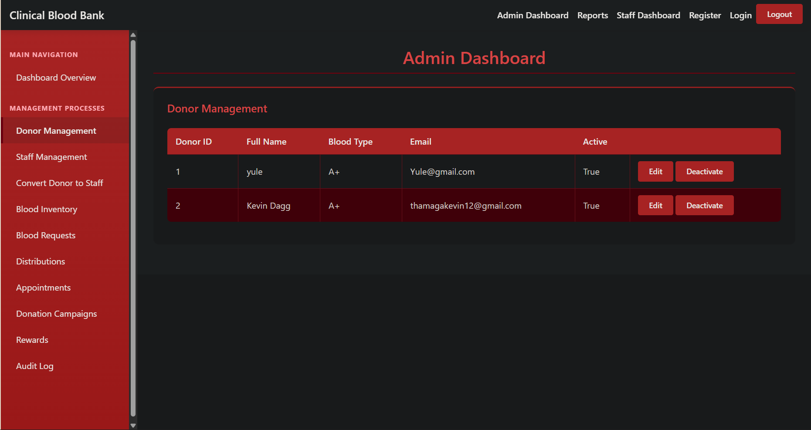
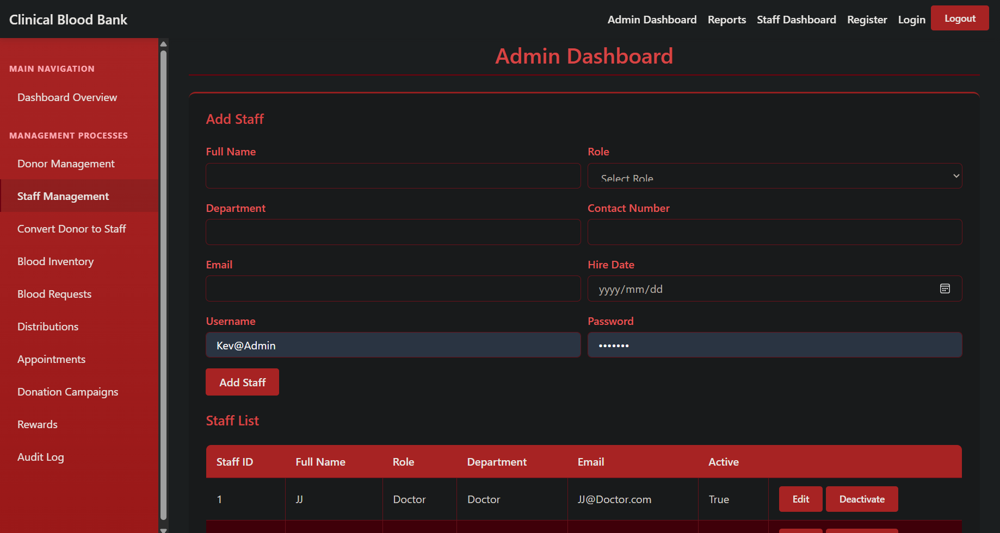
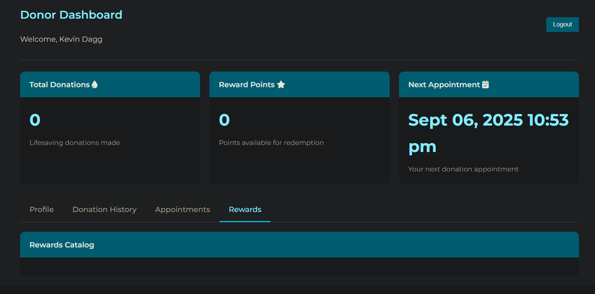
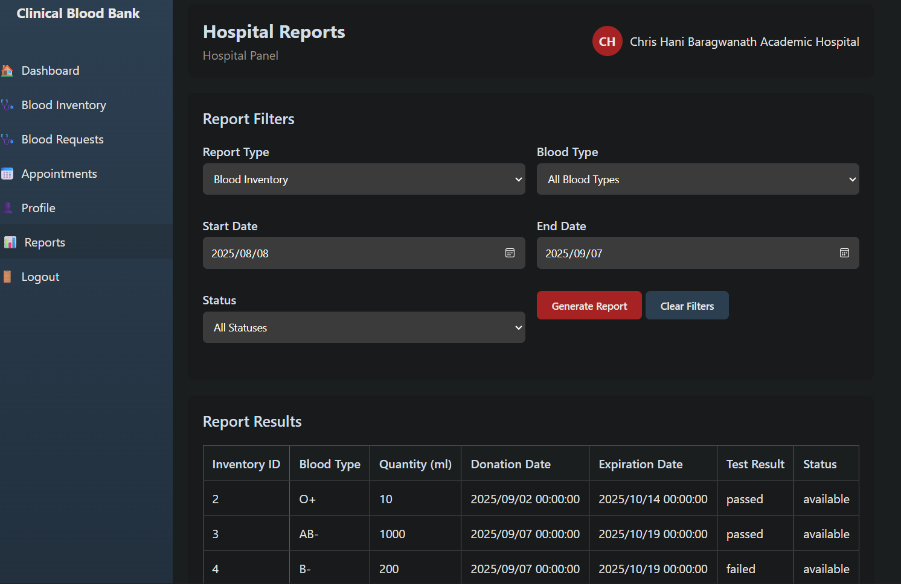

# 🩸 Clinical Blood Bank Management System

> A comprehensive Blood Bank Management System developed to streamline blood donation, inventory management, hospital requests, and donor administration.


---

# 📖 Overview

The **Clinical Blood Bank Management System** is a web-based application designed to improve the efficiency of blood bank operations by digitizing donor management, hospital requests, blood inventory tracking, and administrative processes.

The system enables administrators to monitor blood stock levels, manage donor records, process hospital requests, and maintain accurate records through an intuitive dashboard.

This project was developed as part of my Information Technology studies to demonstrate practical knowledge of:

- ASP.NET Web Forms
- C#
- MySQL Database Design
- CRUD Operations
- Database Management
- User Authentication
- Responsive UI Design

---

# ✨ Features

## 👤 User Authentication

- Secure Login System
- User Roles
- Session Management
- Access Control

---

## 🩸 Donor Management

- Register Donors
- Update Donor Information
- Delete Donor Records
- Search Donors
- Blood Group Classification
- Contact Information Management

---

## 🏥 Hospital Management

- Register Hospitals
- Update Hospital Details
- Manage Hospital Requests
- Track Blood Requests

---

## 🩸 Blood Inventory

- Blood Stock Management
- Blood Group Tracking
- Available Units Monitoring
- Inventory Updates
- Stock Availability

---

## 📋 Blood Requests

- Create Blood Requests
- Request Approval
- Request History
- Request Status Tracking

---

## 📊 Dashboard

The system includes an administrative dashboard that provides real-time information about:

- Total Donors
- Total Hospitals
- Available Blood Units
- Blood Requests
- Inventory Status
- System Statistics

---

# 🖼️ Screenshots

## Dashboard

> *(Add your dashboard screenshot here)*



---

## Donor Management

> *(Add donor management screenshot here)*



---

## Hospital Management

> *(Add hospital management screenshot here)*



---

## Blood Inventory

> *(Add inventory screenshot here)*



---

## Blood Requests

> *(Add blood requests screenshot here)*



---

# 🛠️ Technology Stack

### Frontend

- HTML5
- CSS3
- JavaScript
- Bootstrap
- ASP.NET Web Forms

### Backend

- C#
- ASP.NET Framework

### Database

- MySQL

### Development Tools

- Visual Studio
- MySQL Workbench
- Git
- GitHub

---

# 🗂️ Database Modules

The database includes management for:

- Users
- Donors
- Hospitals
- Blood Inventory
- Blood Requests
- Authentication
- Audit Records

---

# 🚀 Installation

## Clone the Repository

```bash
git clone https://github.com/YourUsername/ClinicalBloodBank.git
```

---

## Open the Project

Open the solution using:

- Visual Studio 2022

---

## Configure the Database

1. Open MySQL Workbench.
2. Create a new database.
3. Import the provided SQL file.
4. Update the connection string inside **Web.config**.

Example:

```xml
<connectionStrings>
    <add name="BloodBankConnection"
         connectionString="server=localhost;database=BloodBankDB;uid=root;pwd=yourpassword;" />
</connectionStrings>
```

---

## Run the Project

Press

```
F5
```

or

```
Ctrl + F5
```

to launch the application.

---

---

# 🎯 Learning Outcomes

This project demonstrates practical experience with:

- Full CRUD Operations
- Object-Oriented Programming
- Relational Database Design
- SQL Queries
- Authentication
- ASP.NET Web Forms
- C#
- Frontend Development
- Backend Development
- Software Engineering Principles

---

# 🔮 Future Improvements

- Email Notifications
- SMS Notifications
- Blood Donation Scheduling
- QR Code Support
- PDF Report Generation
- REST API Integration
- Role-Based Access Control
- Analytics Dashboard
- Mobile Responsive Enhancements
- Dark Mode

---

# 👨‍💻 Author

## Vhukhudo Kevin Thamaga and Tebogo Masiteng

**Final-Year BSc Information Technology Students**

📍 Vereeniging, Gauteng, South Africa

📧 thamagakevin12@gmail.com

🐙 GitHub

https://github.com/Dagg12


# ⭐ Support

If you found this project useful, consider giving it a ⭐ on GitHub.

---

# 📜 License

This project is licensed under the MIT License.

Feel free to use this project for learning and educational purposes.
